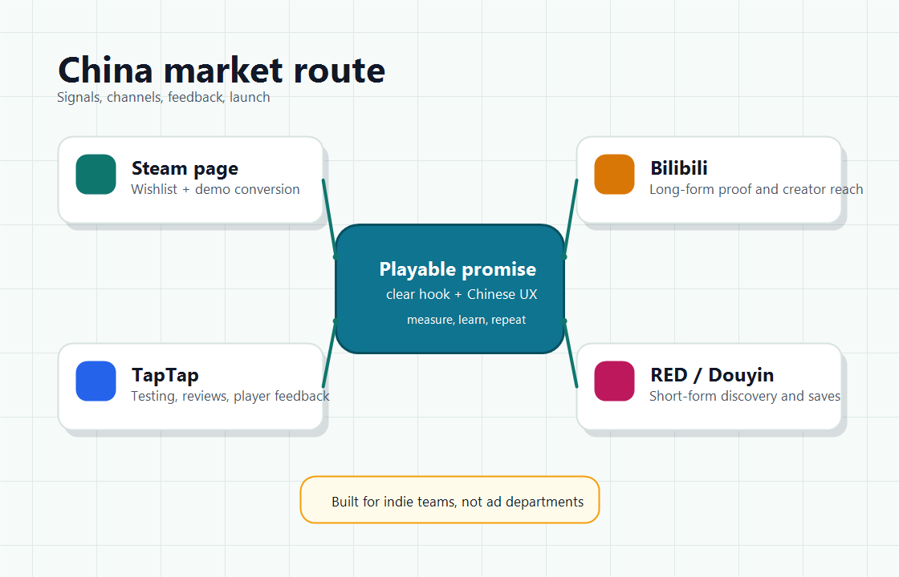

---
hide:
  - navigation
  - toc
---

<section class="hero">
  

    
Independent Game Marketing Handbook

    <h1>How To Market Your Game In China</h1>
    
一个面向独立游戏和小团队的中文开源手册：理解中国玩家、验证卖点、组织渠道、沉淀反馈，并把中文流量真正接到 Steam、Demo 和发售转化上。

    

      <a class="md-button md-button--primary" href="research/china-market-map/">开始阅读</a>
      <a class="md-button" href="operations/90-day-plan/">90 天计划</a>
    

  

  

    
  

</section>

<section class="quick-grid" aria-label="Quick navigation">
  <a class="quick-card" href="research/china-market-map/">
    Research
    <strong>中国市场地图</strong>
    先看渠道、玩家语境和目标拆分。
  </a>
  <a class="quick-card" href="platforms/steam/">
    Platform
    <strong>Steam 中文区营销</strong>
    让社媒流量能被页面和 Demo 承接。
  </a>
  <a class="quick-card" href="channels/bilibili/">
    Channel
    <strong>B 站与内容渠道</strong>
    用视频解释玩法、建立信任和反馈循环。
  </a>
  <a class="quick-card" href="checklists/steam-page-checklist/">
    Checklist
    <strong>发布前自查</strong>
    商店页、本地化、Demo 和活动检查表。
  </a>
</section>

## 这个手册适合谁

  

    <h3>正在做 Steam 游戏</h3>
    
判断中文玩家是否值得优先投入，并把愿望单、Demo、评测和发售转化串起来。

  

  

    <h3>准备中文本地化</h3>
    
不只翻译文本，也检查商店页、截图、PV、字体、UI、客服和差评处理。

  

  

    <h3>想理解中国渠道</h3>
    
B 站、TapTap、小红书、抖音、微博、QQ群和贴吧各自承担不同任务。

  

!!! note "核心观点"
    中国不是一个渠道，而是一组不同语境的社区和平台。对独立游戏而言，Steam 常常仍是最现实的商业闭环；中文社媒更多承担验证、种草、反馈和再营销。

## 推荐阅读路径

  <a href="research/china-market-map/">01理解市场地图</a>
  <a href="operations/90-day-plan/">02制定 90 天计划</a>
  <a href="platforms/steam/">03打磨 Steam 页面</a>
  <a href="checklists/demo-and-festival-checklist/">04准备 Demo 与活动</a>

## 参与贡献

这个仓库最需要真实、具体、可验证的经验：案例复盘、平台规则更新、渠道打法、指标模板和踩坑记录。请阅读 [贡献指南](contributing.md)。
